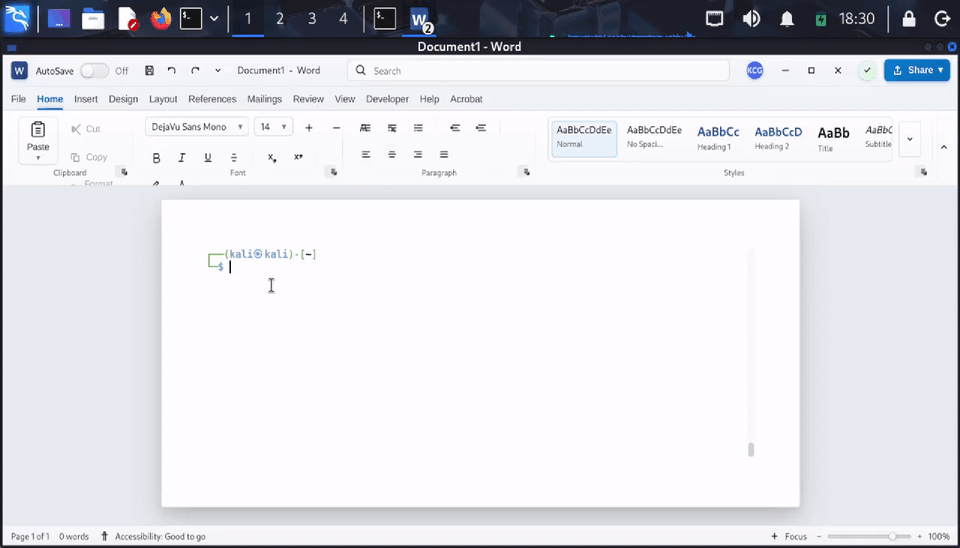

# WordTerm — Word-Style Terminal Emulator


https://buymeacoffee.com/iamkelvingatez


WordTerm is a **fully functional terminal emulator** that presents a **Microsoft Word-style UI**.  
It embeds an **xterm.js** terminal inside a Word-like “document” surface, with a **File-style overlay** for actions, tool launching, theming, and session export.

> **For authorized security research only.** Use only on systems you own or have explicit permission to test.

---

## Table of Contents
- [Overview](#-overview)
- [Features](#-features)
- [Installation](#-installation)
- [Run](#-run)
- [Desktop Launcher (Linux)](#-desktop-launcher-linux)
- [Build](#-build)
- [Project Structure](#-project-structure)
- [Keyboard Shortcuts](#-keyboard-shortcuts)
- [Security & Ethics](#-security--ethics)
- [Troubleshooting](#-troubleshooting)
- [Contributing](#-contributing)
- [License](#-license)

---

## 🎭 Overview

WordTerm makes your terminal look like a document editor:
- Word-style **titlebar**, **tabs**, **ribbon**, and **status bar**
- A single “page” canvas where the **terminal lives**
- A **File** overlay to access actions, tools, view/theme options, and exports

**Key concept:** do terminal work in environments where you want a more neutral, document-like UI.

---

## ✨ Features

### 🖼️ Word-Style UI
- Authentic Word-like layout (titlebar + ribbon + status bar)
- Document canvas with page styling and realistic spacing
- Zoom controls and status area

### 💻 Terminal Functionality
- **PTY-backed shell** via `node-pty` (real terminal behavior)
- Copy/paste + context menu
- Smooth scrolling + scrollback
- Autocomplete:
  - history suggestions
  - command suggestions
  - file/folder completion
- Large paste handling (chunked paste for stability)

### 🧰 File Menu Overlay
- Terminal actions (clear, reset, navigation helpers)
- Tool launcher (configurable quick launch entries)
- View options (font size, theme, terminal display)
- Session management (export history / export buffer)

### 🎨 Customization
- Font selection + size controls
- Multiple themes (light/dark + variants)
- Avatar/initials customization (persisted locally)

---

## 🚀 Installation

### Prerequisites
- Node.js **v14+** recommended (newer is fine)
- npm **v6+**

Check:
```bash
node --version
npm --version
